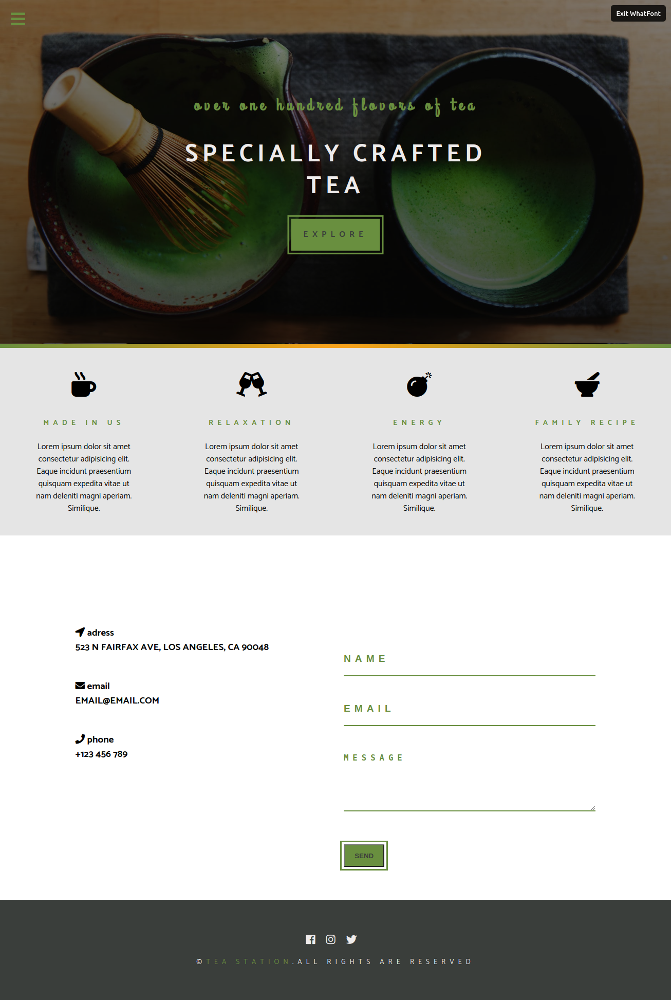
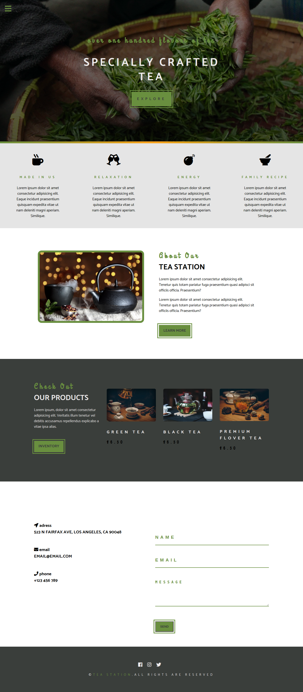

# Tea station

### Live link https://shoirata.github.io/TeaStation/products.html

[Solo project]

>In this project, I  implemented the best HTML and CSS practices.

| Contact page | Homepage|
| -- | -- |
|  | |

## Built With

- SCSS
- HTML
- SASS
- Less
- Java Script

# To get a local copy follow the steps below:

#### 1. Go to https://github.com/ShoiraTa/TeaStation
#### 2. Click on the code button and copy the HTTPS/ SSH URL.
#### 3. On the terminal, type git clone command followed by pasting HTTPS/ SSH URL to clone this repository on your local machine.
#### 4. Run git checkout -b your-branch-name. Make your contributions
#### 5. Push your branch up to your forked repository
#### 6. Open a Pull Request if you want to merge branches with a detailed description of the development branch of the original project for a review

## Author

👤 **Shoira Toshpulatova**

- GitHub: [@githubhandle](https://github.com/shoirata)
- LinkedIn: [LinkedIn](https://www.linkedin.com/in/shoira-tashpulatova-bab4a7122/)

